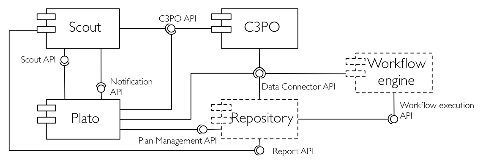

 This work is licensed under a <a rel="license" href="http://creativecommons.org/licenses/by-sa/3.0/deed.en_US">Creative Commons Attribution-ShareAlike 3.0 Unported License</a>.

# APIs for Repository integration with SCAPE Preservation Suite

This project contains the documentation that describes the APIs specification for integration with the SCAPE Preservation Suite, that allows a loosely-coupled architecture for implementing a continuous preservation lifecycle.

The figure above depicts all software components necessary for the preservation lifecycle and focuses on the interfaces between each component. This is not a strict architecture because any of the software components can be skipped and the process it supports can be done manually or with other tools. Every programmatic interface has analogous human interface that achieves the same functionality. This is, therefore, an open and loosely coupled architecture that can be incrementally integrated into a repository implementation.

A repository can integrate into this preservation lifecycle architecture by implementing three interfaces:

1. **Data Connector API**: Interface to create, retrieve, search and update digital objects within a repository \[[PDF](Data_Connector-API_V1.1.pdf?raw=true)\]. To implement the Data connector API, knownledge about the data object model is also needed \[[PDF](Digital_Object_Model_V1.0.pdf?raw=true)\].
2. **Report API**: Interface to retrieve information about events that take place on a repository, e.g. ingest, access, and preservation operations \[[PDF](ReportAPI_V1.0.pdf?raw=true)\]. A reference implementation of the Report API is available for the [RODA repository](https://github.com/openplanets/roda/tree/master/roda-core/roda-core-services/src/main/java/eu/scape_project/roda/core/report) and a set of reusable components to develop the report API for other repository implementations is also [available](https://github.com/openplanets/report-api).
3. **Plan Management API**: Interface to manage and execute preservation plans \[[PDF](Plan Management API_V1.0.pdf?raw=true)\]. The implementation of the Plan Management API can use a Workflow engine to actively perform preservation operations as defined by a preservation action plan. A small scale workflow engine that can be used is [Taverna](http://www.taverna.org.uk).

Reference implementations of all above APIs are being developed for the [RODA 1.2](http://www.roda-community.org) and [Fedora Commons 4.0](http://www.fedora-commons.org) repositories, with focus on creating reusable components that could help with the development of APIs for other repository implementations.
